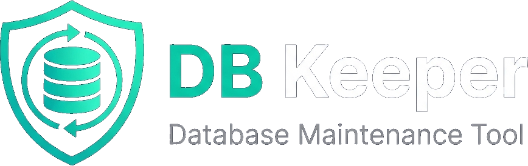

<p align="center">
  
</p>

<p align="center">
  <strong>SQL Server 数据库自动化维护工具</strong><br>
  定时备份 · 存储过程调度 · 备份生命周期管理 · 磁盘空间监控
</p>

<p align="center">
  
  
  
  
  
</p>

---

## ✨ 功能特性

| 模块 | 说明 |
|------|------|
| 🔌 **连接管理** | 多 SQL Server 实例管理，支持连接测试、信任证书配置 |
| ⏰ **定时任务** | 支持每日/每周/每月/间隔/Cron 五种调度模式 |
| 💾 **数据库备份** | 完整备份 / 差异备份，支持压缩、校验、文件名模板 |
| 🧹 **备份清理** | 自动过期清理，按保留天数/份数策略执行 |
| 📜 **存储过程调度** | 定时执行指定存储过程 |
| 📊 **仪表盘概览** | 任务状态、备份统计、磁盘空间实时监控 |
| 📋 **执行日志** | 完整的任务执行记录与错误追溯 |
| 🔒 **启动密码** | 应用启动时密码保护，3 次错误自动退出 |
| 📌 **系统托盘** | 关闭窗口最小化到托盘，后台静默运行 |

## 🏗️ 技术架构

```
┌─────────────────────────────────────────────────┐
│                  DBKeeper.App                    │
│         WPF + WPF-UI (Fluent Design)            │
│         MVVM (CommunityToolkit.Mvvm)            │
├─────────────────────────────────────────────────┤
│              DBKeeper.Scheduling                 │
│         Cronos + System.Threading.Timer          │
│           轻量级自研任务调度引擎                   │
├──────────────────────┬──────────────────────────┤
│   DBKeeper.Executors │     DBKeeper.Data        │
│   备份/清理/SP执行器  │  SQLite + Dapper (本地)  │
│                      │  SqlClient (远程SQL Server)│
├──────────────────────┴──────────────────────────┤
│                  DBKeeper.Core                   │
│            Models · Interfaces · Enums           │
└─────────────────────────────────────────────────┘
```

## 📦 技术栈

| 技术 | 版本 | 用途 |
|------|------|------|
| .NET | 8.0 | 运行时框架 |
| WPF-UI | 3.0.5 | Fluent Design 风格 UI 库 |
| CommunityToolkit.Mvvm | 8.4.2 | MVVM 基础框架 |
| Cronos | 0.8.4 | 轻量级 Cron 表达式解析 |
| Microsoft.Data.Sqlite | 8.0.11 | 本地 SQLite 存储 |
| System.Data.SqlClient | 4.9.0 | SQL Server 连接 |
| Dapper | 2.1.72 | 轻量 ORM |
| Serilog | 8.0.4 | 结构化日志 |
| Hardcodet.NotifyIcon.Wpf | 2.0.1 | 系统托盘图标 |

## 🚀 快速开始

### 环境要求

- Windows 10+ / Windows Server 2016+
- [.NET 8.0 SDK](https://dotnet.microsoft.com/download/dotnet/8.0)
- Visual Studio 2022（推荐）或 VS Code

### 构建运行

```bash
# 克隆项目
git clone https://github.com/your-username/DBKeeper.git
cd DBKeeper

# 构建
dotnet build

# 运行
dotnet run --project src/DBKeeper.App
```

### 发布部署

```bash
# 自包含发布（免安装 .NET 运行时）
dotnet publish src/DBKeeper.App -c Release -r win-x64 --self-contained -o publish/

# 运行发布版
./publish/DBKeeper.App.exe
```

## 📁 项目结构

```
DBKeeper/
├── src/
│   ├── DBKeeper.App/           # WPF 启动项目（UI 层）
│   │   ├── Views/              # 页面（Dashboard, TaskList, Backup...）
│   │   ├── ViewModels/         # 视图模型（MVVM）
│   │   ├── Dialogs/            # 弹窗（编辑任务、编辑连接）
│   │   ├── Helpers/            # 工具类（FolderPicker 等）
│   │   └── Assets/             # 图标、Logo
│   ├── DBKeeper.Core/          # 核心层：模型、接口、枚举
│   ├── DBKeeper.Data/          # 数据层：SQLite + SQL Server 访问
│   │   └── Repositories/       # 仓储实现
│   ├── DBKeeper.Scheduling/    # 调度层：Cronos 定时引擎
│   └── DBKeeper.Executors/     # 执行层：备份/清理/存储过程执行器
├── docs/                       # 项目文档
│   ├── PRD.md                  # 产品需求文档
│   ├── DDD.md                  # 数据库设计文档
│   ├── UI_SPEC.md              # UI 设计规范
│   ├── CODING_STANDARDS.md     # 编码规范
│   └── 当前审查结果与后续开发计划.md # 后续开发主依据
├── DBKeeper.sln                # 解决方案文件
└── README.md
```

## ⚙️ 配置说明

首次运行会在 `data/` 目录下自动创建 SQLite 数据库 `dbkeeper.db`。

应用配置位于 `appsettings.json`：

```json
{
  "AppSettings": {
    "StartupPassword": "admin"
  },
  "Serilog": {
    "WriteTo": [
      { "Name": "File", "Args": { "path": "logs/log-.txt", "rollingInterval": "Day" } }
    ]
  }
}
```

## 🎯 设计亮点

- **极致轻量**：运行内存仅 ~50MB（任务管理器），无重量级依赖
- **自研调度器**：基于 `Cronos` + `Timer` 实现，仅 50KB 依赖，替代 Quartz.NET 节省 300MB+ 内存
- **原生 Win32**：文件夹选择器使用 COM `IFileOpenDialog`，零 WinForms 依赖
- **Fluent Design**：基于 WPF-UI 的现代深色主题界面
- **数据安全**：删除任务时保留历史备份文件和执行日志，不做级联删除

## 📄 License

[MIT License](LICENSE)

---

<p align="center">
  <sub>Made with ❤️ for Database Administrators</sub>
</p>
